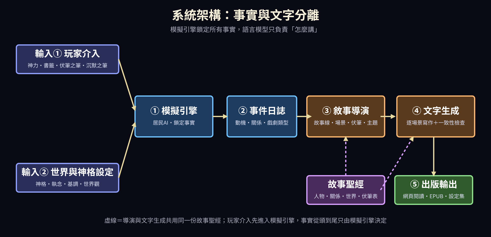
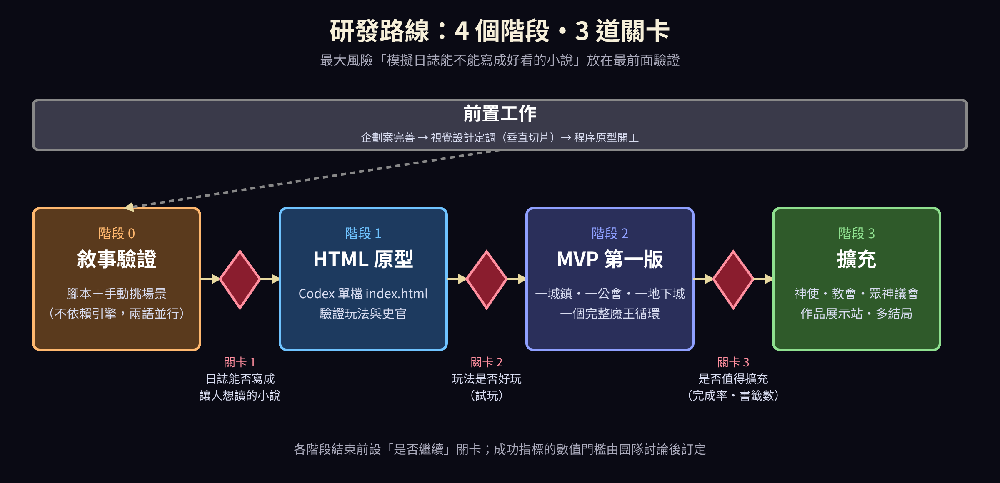

# 《輪迴之天秤》企劃書

Oct 1, 2026 · @SEVEN

## 企劃宣言

《輪迴之天秤》讓玩家以「神」的身份經營一個劍與魔法的異世界，並把每一次魔王討伐循環，寫成一部屬於自己、可以出版的小說。

**核心信念**：每一個故事，都是神在世間給予的一個起點。玩家在遊戲裡回頭追溯「這位英雄為何誕生」時的感動，和我們回望自己人生時問「這件事為何發生」是同一種情緒。這是整份企劃的靈魂，後面所有系統都從這裡長出來。

**一句話定位**：遊戲是寫作工具，玩的過程就是創作，小說是成品。

**對玩家的三個承諾**

- **你的選擇真的留在故事裡**：不是下指令叫 AI 寫字，而是先經營出一個真實發生過的世界，再從中寫成小說。
- **你會愛上其中的人**：靈魂會轉生，羈絆會跨越世代，一個人的幾世人生就是一部連載。
- **成品屬於你**：一個魔王循環就是一季，可以帶走、續寫、出版。

## 產品概要

這是一款神視角的世界模擬遊戲，賣點是「輪迴因果」與「遊戲產出可出版小說」兩者結合，「遊玩成果編成可出版小說」已有網頁服務 Chronostates，這一點本身不是首創；本作的獨特處在於它與輪迴因果、神視角的結合（見「市場定位與競品」的補充調查）。

| 項目 | 內容 |
| --- | --- |
| 暫定名稱 | 《輪迴之天秤》 |
| 類型 | 神視角世界模擬 × 輪迴轉生 × 創作工具 |
| 世界觀 | 歐洲中世紀風格的劍與魔法異世界，有冒險者公會與魔王 |
| 玩家角色 | 神，不直接操控居民，只能間接影響 |
| 目標玩家 | 喜歡箱庭模擬、異世界轉生、長篇故事的玩家，以及想創作但不擅長寫作的人 |
| 平台 | 單機，發行於 Steam |
| 核心產出 | 每個魔王討伐循環一季，生成一部可閱讀、可出版的小說 |

**差異化**

1. **有因果的故事**：事實由模擬鎖定，小說只負責「怎麼講」，故事有伏筆、有成長、不自相矛盾。
2. **輪迴有重量**：前世不是數值繼承，而是會影響下一世的因果，英雄與魔王可以同源。
3. **克制的神力**：神能做的事很多，但每次介入都有代價，玩家要做取捨。
4. **玩家是作者**：成品是自己的作品，開新局的理由是「想看這次會寫出什麼故事」。

## 已決定事項一覽

| 項目 | 決定 |
| --- | --- |
| 類型 | 神視角的人生模擬，單人遊玩 |
| 平台與付費 | Steam 單機買斷 |
| 語言 | 日文與繁體中文同時 |
| 小說風格 | 輕小說風 |
| 小說用途 | 僅限玩家自行運用（免費發表或自費出版），遊戲不販售、不抽成 |
| 玩法 | 不設小遊戲；干涉結果分四段 |
| 視覺 | 正式版為接近 HD-2D 的像素風；原型為特魯內克風 |
| UI | 版面已確認 |
| 史官 | 全員皆主角；有焦點與立傳規則；標示目擊／轉述／推想 |
| 干涉類型 | 神託、恩寵、試煉、干涉靈魂、勢力操作 |
| 美術與 UI | 由專長 AI 依 art-ui-brief.md 製作 |
| 開發順序 | 完善企劃 → 視覺定調 → Codex 先做 HTML 原型 → 程序組做第一版 |

**尚未決定**

- 正式版引擎
- AI 美術方針與 Steam 揭露
- 買斷制下的算力成本
- 候補機制：史書回流、命運濃度與覺醒者、三版本、靈魂交換
- 神話原型
- 各工作群負責人與預算
- 世界設定細節
- 小說插畫風格

## 核心體驗與玩家成就感

神最大的設計風險是「全能帶來的無聊」，所以原則是：能力強，但被限制得有意義。玩家的成就感來自下面六種，所有系統都要對應其中至少一種。

| 成就感 | 玩家會說的話 | 對應系統 |
| --- | --- | --- |
| 作者感 | 「那位英雄會誕生，是因為我三十年前推了他父母一把」 | 因果追溯、編年史 |
| 守護感 | 「我想保護這個人」 | 命運之魂（眷顧者） |
| 掌控感 | 「我用一場小瘟疫化解了一場大戰」 | 天秤、神力組合 |
| 見證感 | 「看著村莊變成王都」 | 編年史、傳說殿堂 |
| 意外感 | 「這個發展我完全沒想到」 | 湧現式模擬、同源揭曉 |
| 沉重感 | 「我做了艱難的選擇，也承擔了後果」 | 祈禱兩難、延遲後果 |

**核心遊戲循環**

1. 觀察世界，收到祈禱或發現異狀
2. 判斷與抉擇，必要時介入並付出代價
3. 居民自行反應，後果延遲顯現（數年甚至數世之後）
4. 事件累積成編年史與傳說，導演層從中編成小說
5. 循環結束，產出一季小說，下一季接續

關鍵是**延遲回饋**：今天的神諭，三十年後才長成英雄或災禍。

## 世界與居民模擬

居民像真人社會一樣各司其職地生活，冒險者公會是世界的心臟，居民的需求會化為祈禱傳到玩家手上。

**居民生命週期**：出生、成長、就業、戀愛成家、老去或戰死、轉生。

**天生職業**由靈魂決定，不只有戰鬥職：

- 戰鬥職：劍士、法師、僧侶、盜賊
- 生產職：鐵匠、農夫、煉金術師
- 社會職：商人、吟遊詩人、公會櫃檯

**經濟生態**：冒險者需要裝備與藥水，所以鐵匠與煉金師的生計和前線戰況連動。戰事一緊武器漲價，農夫被徵召則糧食吃緊。

**需求系統**：飢餓、安全、財富、歸屬、名譽、信仰。需求無法滿足時化為祈禱，這是玩家最主要的資訊來源。

**人際關係**：家族、師徒、戀人、宿敵、公會夥伴，全部記錄在案，也是日後小說的人物關係網。

**冒險者公會**

- 任務板由世界狀態自動生成（魔物出沒、商隊護送、遺跡探索）
- 公會等級、聲望、隊伍編成都由 AI 自行運作
- 玩家可以觀察，但不能直接指揮隊伍

**每個重要角色的戲劇骨架**：生成時帶有「渴望、恐懼、秘密、謊言」四個欄位，是日後小說角色弧線的來源（詳見「小說生成系統」）。

## 神的玩法系統

神的力量來自居民的信仰，每一次介入都有代價，這讓「全能」變成「必須取捨」。

**資源：信仰力**。居民的祈禱、感謝、敬畏累積成信仰力，是所有神力的來源。神蹟太頻繁會讓人覺得理所當然，信仰開始通膨。

**神力五類**

| 類型 | 例子 | 代價與風險 |
| --- | --- | --- |
| 神託 | 夢中給暗示、讓某人靈光一閃 | 成本低，但對方可能誤解 |
| 恩寵 | 治癒瀕死者、祝福作物 | 過度依賴，居民失去自立 |
| 試煉 | 投放魔物、天災、疫病 | 死亡率上升，但可能催生英雄 |
| 干涉靈魂 | 指定轉生方向、封印或釋放記憶 | 高耗，每個靈魂有「干涉疲勞」 |
| 勢力操作 | 強化魔王軍或人類王國 | 直接改變陣營平衡 |

**三種限制**

1. **資源限制**：信仰力有限，救人換來信仰，救太多信仰會通膨。
2. **資訊限制**：只能聽到祈禱者的聲音，想看特定角落要消耗「神眼」，所以可能漏掉正在形成的叛亂。
3. **手段限制**：神不能直接操控人，只能託夢、顯示徵兆、改變環境，居民會自己判斷，可能誤解、拒絕甚至背叛。

**神使與先知**：玩家可以挑選凡人成為先知、聖騎士或聖女作為代理人。他們有自己的個性與慾望，可能曲解、動搖、墮落，也可能比神更有智慧。先知被世人知道後可能發展出教會，教會會有自己的政治立場，甚至背離初衷，製造「我創造的組織失控了」的戲劇張力。

**神格選擇**（開局決定玩法風格）

| 神格 | 特色 | 玩法傾向 |
| --- | --- | --- |
| 戰神 | 強化勇者、戰爭獎勵 | 激進，愛製造英雄 |
| 豐穰之神 | 農業與繁榮加成 | 穩健，經營型 |
| 命運之神 | 能看見與編織因果 | 策略，操作轉生 |
| 智慧之神 | 資訊視野最廣 | 觀察型，偏分析 |
| 死亡之神 | 管理輪迴之河 | 主導轉生，黑暗風格 |
| 混沌之神 | 擅長製造意外 | 高風險高回報 |

**神的形象**：居民對神的認知由玩家的作為累積而成，神話會被傳誦並扭曲。想當慈愛的神，卻可能因一次瘟疫被傳成殘酷之神，玩家要管理這個形象。

**干涉的成否判定（已定）**：不設小遊戲或解謎。成否由數值與機率決定，結果分四段：大成功／成功／被曲解／失敗。顧問只顯示成功機率與風險，不替玩家決定。

## 轉生因果系統

戰死或老死的靈魂進入輪迴之河，依前世的因果決定下一世的出身與職業，前世不是數值繼承，而是影響下一世的故事條件。

**因果值四類**

| 因果 | 來源 | 對下一世的影響 |
| --- | --- | --- |
| 善業 | 守護他人、犧牲、慈悲 | 出生於好環境，天生好感度高 |
| 惡業 | 掠奪、背叛、殺戮 | 苦難出身，也可能成為魔王候補 |
| 功業 | 技藝、成就，不分善惡 | 更高階的天賦與職業 |
| 執念 | 未完成的願望、強烈羈絆 | 殘留既視感，與前世戀人或仇敵相遇時觸發特殊事件 |

**命運之魂（眷顧者）**

- 玩家可標記少數靈魂（暫定最多 5 個）為眷顧者
- 系統追蹤他們的每一世，留下跨越數百年的「靈魂履歷」
- 眷顧者的死亡會讓玩家真正心痛，這是情感核心

**轉生帶來的敘事機會**

- **前世殘影**：農夫今生突然會揮劍，因為前世是劍聖
- **宿命重逢**：前世夫妻轉生後隔著國境相遇，神可以推一把，也可以拆散
- **職業的諷刺**：殺人無數的劍士，來世成為僧侶
- **傳承**：師父的劍，三世之後被弟子的轉生者拾起

轉生系統同時是遊戲機制與小說的長線伏筆引擎，一般小說要費盡心思設計的反轉，這裡是系統的副產品。

## 天秤與魔王

玩家的真正任務不是讓人類贏，而是讓這場戰爭永遠有意義；魔王不是單純的敵人，而是系統的一部分。

**光暗天秤**

| 天秤狀態 | 世界發生什麼 |
| --- | --- |
| 過度偏光 | 世界停滯：冒險者無事可做，經濟衰退，人們懶散腐化 |
| 過度偏暗 | 世界滅亡：魔物氾濫，村莊被毀 |
| 動態平衡 | 文明發展、技術進步、英雄輩出 |

**魔王機制**

- 魔王之位是一個空缺的席位，由惡業最高的靈魂轉生填補
- 魔王可能就是某位前世英雄的轉生，英雄與魔王同源
- 被打倒後不是結束，而是進入「新時代」：失去共同敵人的人類開始內部分裂，玩家要決定是否扶植下一任魔王

**同源揭曉**是核心反轉：玩家在遊戲中有機會察覺端倪，小說讀者則在終章被完整回收，同一個秘密，兩次衝擊。

**多結局**

1. **永恆輪迴**：維持平衡，世界無限延續（沙盒結局）
2. **黃金時代**：魔王被打倒且不再誕生，但世界逐漸失去活力
3. **神的退場**：居民強大到不再需要神，信仰歸零，是一種苦澀的勝利
4. **滅世**：失衡導致文明崩潰

## 目標與進度結構

純沙盒容易讓玩家不知道要做什麼，所以目標分成短、中、長三層，神格成長是主要的進度感。

| 層級 | 節奏 | 內容 |
| --- | --- | --- |
| 短期 | 每幾分鐘 | 祈禱與抉擇。每天有數件值得回應的祈禱，其中要有兩難：兩支軍隊都祈求勝利、母親求你救兒子但他將來會成為暴君。後果延遲顯現，製造期待與後悔 |
| 中期 | 每個時代 | 天命任務。例如「三十年內讓王國與精靈族結盟，且天秤偏差不超過 20%」，完成可獲得神格成長，解鎖新神力 |
| 長期 | 整局遊戲 | 神的執念。開局由玩家選擇這一局的終極目標，讓每局都有個人主題 |

**神的執念（範例）**

- 讓一對命運戀人終於相守一生
- 創造一個不需要神的世界
- 讓魔王與勇者放下仇恨
- 見證一千年的繁榮

**神格成長**

- 神格等級：解鎖更高階的神力與視野
- 神殿與聖地：居民為神建的神殿是力量的錨點，被毀會有大損失
- 萬神殿（進階）：其他神明的 AI 也在影響世界，信徒圈越大越能與他神交涉、結盟或對抗
- 神之殿堂：被祝福而成名的英雄死後入殿，是收藏型成就

## 小說生成系統

模擬產生的是事件，小說需要的是意義，所以在「模擬」與「文字」之間必須加一層「敘事導演」，負責挑選、編排、埋伏筆與定主題。

**模擬層：讓世界長得出故事**

- 事件記錄意義，不只記錄事實：涉及誰、關係、情感、代價，以及戲劇類型（背叛、犧牲、重逢、誤會、救贖、諷刺、遲來的真相）
- 重要角色帶有戲劇骨架：渴望、恐懼、秘密、謊言（對自己相信的錯誤信念），故事的動人處多來自謊言被現實戳破
- 資訊不對稱：玩家作為神本來就全知，與小說讀者的視角重合，天然具備「戲劇反諷」

**導演層：像園丁，不像編劇**

- 故事線偵測：自動辨識潛在線索（例如前世戀人轉生後處於敵對陣營）並持續追蹤
- 章節骨架：以魔王循環為單位，分為序章、第一部（成長）、第二部（魔王覺醒）、第三部（決戰前夜）、終章（餘波與真相）
- 伏筆登記簿：重要的誓言、遺物、預言被登記，並在後續章節回收
- 主題：每個循環由玩家的神之執念加世界狀態推導出一個主題（例如「仇恨的輪迴」），章節取捨圍繞主題

**文字層：怎麼寫成小說**

- **事實由模擬鎖定**：誰死、誰愛誰、誰背叛誰不可被語言模型改動，模型只負責「怎麼講」
- 故事聖經：人物、關係、世界設定、伏筆清單整理成結構化資料餵給模型，維持前後一致
- 角色口吻檔案：主要角色各有說話風格，對白不會千人一面
- 重點精寫、其餘摘要：一個循環可能有數萬件事件，只挑 20 至 40 個關鍵場景完整寫成
- 循環結束後才生成，有「等待出版」的期待感，也方便控管成本
- 輸出：網頁閱讀與 EPUB，附人物年表、家譜、世界地圖

**玩家作為作者與編輯**

| 工具 | 作用 | 代價 |
| --- | --- | --- |
| 序章定調 | 選擇基調（悲壯史詩、溫暖群像、黑暗悲劇、諷刺喜劇），影響導演取捨 | 開局選擇 |
| 伏筆之筆 | 刻意埋下伏筆（讓某把斷劍留存、讓一句預言流傳） | 消耗神力 |
| 書籤 | 標記「這一刻值得記錄」，導演優先考慮寫入 | 數量有限 |
| 沉默之筆 | 讓某些事不入史冊，但事件仍在，日後可能以意外形式浮現 | 消耗神力 |
| 神的章節 | 玩家的重大介入被寫成小說裡的「神諭」，旁白用另一種語氣 | 無，自動產生 |

**敘事模板（導演層的故事配方）**

| 情緒 | 模式 | 例子 |
| --- | --- | --- |
| 惋惜 | 錯過的重逢 | 兩個靈魂轉生五次始終差一步，終於相遇時卻在敵對陣營 |
| 感動 | 無名者的犧牲 | 被忽略的村人，其善業在後世改變英雄的命運 |
| 意外 | 同源揭曉 | 魔王的前世，是第一章那位被背叛的英雄 |
| 諷刺 | 善意的災難 | 神為救一人而介入，反而促成更大的悲劇 |
| 傳承 | 跨世的劍 | 師父的劍，三世之後被弟子的轉生者拾起 |
| 對照 | 三世並置 | 同一靈魂三世三種人生，章節交錯呈現 |

## 史官與顧問

遊戲中有兩個常駐角色：史官負責記錄已發生的事，顧問負責規劃尚未發生的事，玩家可以隨時查看小說的生成狀況，並詢問「想讓故事往這個方向走，該做什麼」。

**史官：世界裡的司馬遷**

史官是居民，有名字與個性，住在神殿旁的書房，只記錄他看得到、聽得到的事。他依《史記》的紀傳體編寫，所以小說天生有章法：

| 體例 | 本作對應 |
| --- | --- |
| 本紀 | 王國與魔王軍的興衰、大戰役 |
| 世家 | 家族、公會、教會的傳承 |
| 列傳 | 一個靈魂的跨世人生（靈魂履歷） |
| 史官曰 | 每卷末尾的評論，點出本季主題 |

- **不全知**：他只寫聽聞與目擊，所以會有誤記、傳聞與偏見；玩家用「沉默之筆」封存的事，他寫不到
- **有立場**：他可能偏愛某位英雄，對魔王軍的描寫帶著敵意，影響文字語氣
- **史官書房介面**：顯示目前寫到哪一卷、正在追蹤的人物、最新手稿、未回收的伏筆；玩家可以批註、委託他多追蹤某人，但不能改他已寫的事實（事實鎖定原則）
- **兩階段生成**：遊戲進行中，史官只產出輕量的手稿與摘要（以遊戲內一年或一季為一卷）；循環結束後才精寫定稿，以控制成本
- **彩蛋**：寫到某一卷，他開始懷疑「是否真有神在撥動這一切」，呼應嵌套結構

**顧問：規劃尚未發生的事**

1. 玩家說出想要的方向（例如「悲劇的師徒情」「讓魔王與勇者和解」）
2. 顧問讀取導演層追蹤的故事線，回報可行度，列出候選做法與各自的代價、風險、預計見效時間
3. 玩家自己選擇，顧問不替玩家決定

- **只給機率與風險，不給劇本**：居民有自由意志，常常不照預期走，否則遊戲會被「解」掉
- **會說不可行**：例如關鍵人物已死、因果不足
- **視野取決於神格**：智慧之神的顧問看得更遠
- **預演**：顧問快轉模擬數次，告訴玩家各種結局的大致機率，消耗信仰力或神眼
- **也處理小說層面的問題**：「第三部節奏太慢」「有伏筆未回收」，直接使用導演層的伏筆登記簿
- **故事目標**：玩家可設定目標（悲壯、同源揭曉、宿命重逢），顧問像任務清單一樣追蹤進度

**兩個角色分開的原因**：史官只記過去，不會洩漏未來；顧問可以暗示可能性，但不能改寫已發生的事，劇透與事實鎖定都好控制。

**風險**：即時生成手稿有算力成本（兩階段生成緩解）；顧問若給出必然有效的答案會破壞玩法（只給機率）；預演需要多次模擬，要限制次數與規模。

## 從行動到台詞：戲劇化層

居民在模擬中沒有台詞，只有行動與數值；台詞是在「戲劇化層」由行為紀錄推導出來，並藉由史官的見聞身分讓它成立。這一層是小說生成能否成功的關鍵。

**五個機制**

1. **記錄「為什麼」，不只記錄「做了什麼」**：Utility AI 與 GOAP 選擇行動時本來就會算分，把得分最高的幾項考量（需求、恐懼、關係、渴望）存進事件日誌，就是現成的動機痕跡。角色的秘密、謊言、此刻情緒與「他知道什麼」一併記錄。
2. **場景化**：導演層只挑「有東西改變」的事件做成場景，例如關係翻轉、謊言被戳破、誓言成立或破裂、死亡、前世殘影觸發。場景卡包含地點、在場者、各自想要什麼、隱瞞什麼、必須達成的情緒轉折。其餘事件由史官敘述帶過，不寫對白。
3. **台詞由動機與潛台詞生成**：模型的任務是「讓這個人在這個處境下，說出他願意說的那一部分」，說出口的與沒說的落差就是戲。口吻由數值與特質推導成旋鈕（用詞正式度、話量、直率度、職業詞彙、年齡），日文與繁體中文各有一套人稱與語尾設定。前世殘影可以漏進用詞，例如農夫忽然用了劍士的說法。
4. **用史官的不全知讓台詞合理**：史官沒有全程在場，所以台詞分三種可信度：目擊（直接引述）、轉述（證人所說）、推想（史官自己的猜測，以「史官曰」標明）。小說中的虛構台詞因此是史官聽來或推想的，不違反事實鎖定，也自然帶出多版本敘述。
5. **名台詞進伏筆登記簿**：重要的誓言與口頭禪被記錄成物件，日後在死亡、轉生、重逢時回收。同一句話在三世之後換了人說，是最容易打動讀者的手法。

**範例**（示意，非最終格式）

| 階段 | 內容 |
| --- | --- |
| 模擬紀錄 | 第 312 年，老劍士 A 拒絕北境遠征，改派弟子 B，A 留守 |
| 動機痕跡 | 恐懼：再失去弟子（高）；謊言：「只要夠強就不會失去任何人」；秘密：右手已不穩，B 不知情 |
| 場景卡 | 地點：黃昏的訓練場；A 想要：把 B 送離險境但不說破；轉折：B 帶著誤解出發 |

小說片段（繁體中文版，最後一句屬「轉述」）：

「這趟北境，你去。」

B 愣了一下。「師父不是說過，北境的魔物只有您斬得乾淨嗎？」

A 沒有回頭，只是把磨到一半的劍放回架上。「人老了，劍就會鈍。你不一樣。」

劍並沒有鈍。鈍的是握劍的那隻手，這件事他連弟子也沒說。據當晚的廚娘說，老人在門口站了很久。

**風險與對策**

- 台詞長出模擬中不存在的新事實：台詞不得揭露模擬中沒有的秘密或承諾，重大言行必須有對應的事件紀錄，否則只能以「推想」呈現
- 雙語口吻不一致：兩語各自設定人稱、語尾與口頭禪，不互為翻譯
- 成本：只對 20 至 40 個關鍵場景精寫對白，其餘不寫

## 史官的焦點與玩家插手

全員都是主角，但書的篇幅有限，所以史官寫的是「世界的故事」，以許多人的視角交織，而不是某一個人的故事。體例沿用《史記》：本紀寫世界主線，列傳寫個人。

**誰會被寫進書裡**

1. **人物誌（全員）**：每位居民自動有一份記錄（生卒、職業、關鍵事件），不花生成算力，玩家隨時可查。
2. **立傳（聚光燈）**：被聚光燈照到的人才有手稿。眷顧者必定立傳；故事張力高的人自動立傳；玩家可請史官替某人立傳，受「執筆名額」限制（同時進行的傳有上限，也是算力上限）。
3. **補傳**：事後發現某個無名者影響深遠（例如其善業改變了英雄的命運），史官可依完整事件日誌追補其傳，這是「無名者的犧牲」的回收方式。

**視角選擇**：每個場景的視角預設為該場景中「最有東西可失去」的人，玩家可以釘選視角。

**切換方式**

- **地圖與書房雙向連結**：點地圖上的居民跳到他的傳，點文中的名字讓地圖鏡頭移到他身上
- **名簿**：依故事張力排序，可依職業、陣營、前世篩選
- **故事線視圖**：多軌時間軸，每人一軌，軌道交會處是相遇、衝突或宿命重逢
- **執筆中跑馬燈**：主畫面底部顯示史官正在寫哪一場，不必打開書房也看得到

**即時觀看**

- 史官的記錄落後世界半步，以場景結束為單位寫成，不逐字追著事件寫
- 文字分三種墨色：墨未乾（剛結束的場景，可能被後續事件補充）、手稿、定稿
- 遊戲加速時史官會落後，介面顯示「待寫 N 場」，玩家可調整執筆優先序
- 成本：逐場景生成，不逐 tick 生成；買斷制下算力由誰負擔仍待決定

**插手：兩種性質不同的手段**

| 類型 | 內容 | 是否改變事實 |
| --- | --- | --- |
| 改「怎麼寫」 | 批註、指定視角、基調、書籤、沉默之筆 | 否 |
| 改「會怎麼發生」 | 選取文字，開出插手選單，使用神力 | 是，只影響現在之後 |

- **點文字插手**：選取一段文字，系統依該場景的人物與狀態開出插手選單（託夢、治癒、讓某人出現等），顧問預估可行度與風險，確認後付出神力，結果以「神的章節」寫入小說
- **過去不能改**：已發生的事實鎖定，插手只作用在現在之後；想改變過去事件的後果，要靠轉生與因果（下一世）
- **高潮預警**：導演層偵測到某條線的張力正在升高，會在書房邊註提示「此線將進入高潮」，讓玩家能在事情發生前插手，否則玩家永遠只能事後反應
- **章節存檔點（可選模式）**：輕鬆模式可回到某一章之前重寫；正史模式不可回頭，保留沉重感

**範例流程**：玩家讀到「老人在門口站了很久」，選取這句話，選單列出「託夢勸他說實話」「治癒他的手」「讓弟子提早察覺」。顧問回報「託夢：可行度中，老劍士可能視為示弱而拒絕」。玩家確認後，下一個場景的手稿出現「神的章節」，老劍士是否改口由模擬決定。

**風險與對策**

- 名簿太長找不到人：張力排序與篩選
- 玩家以為插手保證有效：顧問只給機率，結果由模擬決定
- 預警太頻繁變成打擾：設定閾值，只對眷顧者與高張力線預警
- 高速遊玩時史官寫不完：以張力排序決定先寫哪一場，其餘標示待寫

## 創作者經濟與商業模式

這個模式把遊戲從「消費內容」變成「創作平台」：玩家玩的過程就是在寫作，成品是自己的作品，可以出版販售。

**季制出版**：第 1 世就是第 1 季，一個魔王討伐循環生成一部作品，下一個循環接續成第 2 季，形成系列。

**創作與販售流程**

1. 玩：經營世界，與神力、伏筆、書籤互動
2. 循環結束：導演層編章，生成初稿
3. 編修：玩家調整章節取捨、基調與用詞
4. 出版包：排版、封面、插圖、人物設定集
5. 上架：玩家自行投稿網路小說站、電子書平台或製作同人誌

**收入來源（已決定買斷，細節待定）**

| 項目 | 說明 |
| --- | --- |
| 出版包 | EPUB 排版、封面、人物設定集、世界地圖等，內建於買斷版成品輸出，不另外收費 |
| 生成額度 | 買斷制下無法持續收費，算力成本如何處理仍待決（見待決事項） |
| 高階神格或神力 | 作為選配 DLC，提供玩法變化，不影響故事品質上限，避免付費即勝 |
| 作品展示站（後期） | 玩家互讀彼此的世界，優秀作品帶來新玩家 |

**買斷制的影響**：Steam 買斷之下，上表的「生成額度」不能靠持續收費。可能做法有三，尚待決定：內建一定額度、用完後由玩家自備 API 金鑰；額度包以 DLC 加購；研究在玩家本機執行的模型，把成本轉到玩家硬體（品質需驗證）。作品展示站需要伺服器與營運，後期再評估。Steam 對 AI 生成內容有揭露規定，上架前需確認最新規範。

**小說的用途（已決定）**：成品僅供玩家自行運用，可免費發表在網路小說站，或自費出版；遊戲不代售、不抽成。因此「出版包」不再是收入來源，而是買斷內容的一部分（排版、封面、設定集的輸出功能），上表的收入項目需對應調整。

**社群循環**：玩家把作品發表到小說站，讀者因作品而認識遊戲，成為新玩家，再產出新作品。作品本身就是宣傳管道。

**嵌套的敘事彩蛋**：玩家是居民的神，讀者又是這個故事的「神」，因為讀者決定故事被不被看見。可以在小說終章或後記，讓居民在夢中隱約感覺到「有人在讀著我們」。

**版權原則（正式推出前須由律師確認）**

- 使用條款要明確寫出玩家對成品的歸屬與授權範圍
- 玩家的創作貢獻（選擇、編輯、伏筆）要有可記錄的證據，例如操作紀錄與編輯歷史
- 日本與台灣對 AI 生成內容的著作權認定仍有灰色地帶，各投稿平台對 AI 生成內容的揭露規則也需逐一確認，輸出時可附標示

## 市場定位與競品

本作站在「箱庭模擬」「異世界轉生」「創作工具」三個需求的交叉點，競品各自只覆蓋其中一塊。以下依個人所知整理，屬方向性參考，立項前需逐一查證現況。

| 參考作品 | 值得學習 | 與本作的差異 |
| --- | --- | --- |
| RimWorld | 以「說書人」機制讓模擬長出故事 | 沒有輪迴，也不產出可出版的完整作品 |
| Dwarf Fortress | 自動生成世界史與傳說 | 紀錄偏事實，缺少敘事導演與文字層 |
| Crusader Kings 系列 | 角色特質與家族關係驅動戲劇 | 單一世代視角，沒有跨世因果 |
| The Sims 系列 | 日常生活模擬與情感連結 | 沒有世界級衝突與神的視角 |
| Majesty 系列 | 間接指揮冒險者的玩法 | 沒有因果轉生與小說產出 |
| AI 小說生成工具 | 降低寫作門檻 | 缺少真實發生過的世界，因果與伏筆靠提示詞維持 |

**補充調查（2026-10-01，依搜尋摘要，未逐頁開啟）**

- **Chronostates**：網頁版替代歷史遊戲，宣稱可把遊玩結果編成可出版的小說，並自動累積世界設定集。「遊戲產出小說」已有人做，但它是替代歷史題材、事件由 AI 生成，不是常駐居民的世界模擬
- **Creator Chronicles**（Steam，2026 年 9 月發售）：公會經營與地城題材，宣傳語是「你的每個決定都會成為自己的編年史」，頁面未提到小說輸出。題材與文案接近，需持續觀察
- **異世界冒険者ギルド**（Steam，2026 年 1 月開始搶先體驗）：公會經營 SRPG，代表異世界公會題材已相當擁擠
- **Chronicle Forge**：GitHub 上的轉生 roguelite 專案，玩家是唯一的轉生者並產出編年史；視角是轉生者而非神，規模是個人專案

**判斷**：「異世界公會」與「AI 小說」各自都不稀有，稀有的是「神視角世界模擬、轉生因果、史官寫成輕小說」三者合一。這是本作要守住的差異化，也是商店頁與宣傳的重點。

Sources: [Chronostates](https://www.chronostates.io/) · [Creator Chronicles](https://store.steampowered.com/app/3947460/_/?l=english&snr=1_239_1700__1707_13) · [異世界冒険者ギルド（4Gamer）](https://www.4gamer.net/games/937/G093716/20260113017/) · [Chronicle Forge](https://github.com/shoebill-dev27/chronicle-forge)

**目標市場**

- **日本**：異世界轉生、箱庭育成、放置觀察皆為成熟需求，網路小說投稿文化與同人誌市場也提供了出口。預設文體定為輕小說風
- **華語圈**：網路小說閱讀與創作人口龐大，「玩家即作者」的概念容易理解
- **首發語言**：日文與繁體中文同時推出，兩語各自獨立生成與評測，不互為翻譯。文字品質是本作的核心，雙語會讓驗證成本倍增，所以敘事驗證階段就要兩語並行

**核心訴求**：「你寫的不是小說，是一個世界的人生。」

## 技術架構與規模

技術上的關鍵設計是「事實與文字分離」：模擬引擎鎖定所有事實，語言模型只負責敘述，這是防止小說前後矛盾的根本原則。

玩家的介入先進入模擬引擎，導演與文字生成共用同一份故事聖經，事實從頭到尾只由模擬引擎決定。

**核心元件**

- **模擬引擎**：驅動居民行為，建議以 Utility AI 或 GOAP 起步
- **事件日誌**：每個事件附帶敘事標籤（涉及者、關係、情感、代價、戲劇類型）
- **故事聖經**：人物、關係、世界設定、伏筆清單的結構化資料
- **敘事導演**：偵測故事線、挑選場景、編排章節、登記與回收伏筆
- **文字生成**：依場景細綱逐場景生成，之後做一致性檢查與潤稿
- **出版輸出**：網頁閱讀與 EPUB 排版

**規模與呈現**

- 初期活躍居民 200 至 500 名
- 時間流速可調（1 倍、5 倍、50 倍），讓一世人生能在數分鐘內看完
- 視角建議 2D 俯視或等角，成本低，也適合長時間觀察

**生成成本控管**

- 一個循環只精寫 20 至 40 個關鍵場景，其餘以敘述過渡
- 循環結束後離線生成，不需即時
- 一致性檢查以結構化資料比對（誰死了、誰在哪裡）為主，不全靠模型判斷

## MVP 範圍與里程碑

建議分四個階段推進，每個階段結束前設一個「是否繼續」的關卡，最大的技術風險「模擬日誌能不能寫成好看的小說」放在最前面驗證，避免做到一半才發現。

第一道關卡驗證最大的技術風險：模擬日誌能否寫成讓人想讀下去的小說，後面的開發投資都建立在這一關之上。

階段 0 之前還有兩項前置工作：企劃案完善與視覺設計定調，程序原型在這之後開工（見「專案分工」的開發順序）。

**MVP 範圍**

- 一座城鎮、一座冒險者公會、一座地下城
- 簡化版轉生與因果值（先做善業、惡業、功業三類）
- 少數神力（神託、恩寵、試煉）與信仰力
- 命運之魂（眷顧者）與書籤
- 一個完整的魔王循環，生成一季小說初稿

**暫不納入 MVP**：眾神議會、神使與教會政治、作品展示站、多語言、多結局全套。

**成功指標**：各階段數值門檻由團隊討論後訂定，例如試讀者「想繼續讀下一章」的比例、玩家完成一個循環的比例、玩家主動標記書籤與伏筆的次數。

## 視覺與世界觀設計

視覺與世界觀要在程序開發第一版之前定調，因為遊戲介面、角色造型與小說插圖都從這裡長出來。

| 定調項目 | 內容 | 銜接 |
| --- | --- | --- |
| 世界觀設定集 | 歐洲中世紀風格的異世界：地理、種族、勢力、魔王軍、神話 | 敘事組的故事聖經基礎 |
| 美術風格 | 日式像素風，精緻度接近 HD-2D（基調參考特魯內克大冒險一類的親切風格，造型原創），立繪與插畫用輕小說插畫質感 | 同一套風格延伸到小說封面與插圖 |
| 角色造型規範 | 職業的剪影與配色；轉生後職業改變如何一眼辨識；前世殘影的視覺線索 | 程序組的角色生成與顯示 |
| 神視角呈現 | 2D 俯視或等角；世界、城鎮、個人三個縮放層級 | 介面與效能預算 |
| 介面風格 | 史官書房的書卷質感；日文與繁體中文的字型與排版 | 雙語介面實作 |
| 小說排版 | 輕小說版面，日文與繁體中文各自的版面規則 | 出版輸出 |

**視覺方向（暫定，標示「待確認」者仍需團隊決定）**

- **整體風格（已定）**：日式像素風，精緻度接近 HD-2D（像素角色放進有光影的立體場景，加上景深與光暈），基調參考《特魯內克大冒險》這類勇者鬥惡龍系的親切風格：大頭小身的小人、明亮溫暖的配色、簡潔的視窗介面。只借風格與氛圍，造型全部原創，不使用該系列的角色、怪物與招牌設計。
- **兩層視覺**：人間界溫暖親切（像素）；神域（天秤、輪迴之河、轉生演出、史官書房、神力介面）高對比、符號化，借女神轉生一類作品的氣質，造型原創。
- **角色呈現**：地圖上是像素小人，職業靠剪影與配色辨識；重要人物用立繪；關鍵時刻用事件畫面。
- **視覺母題**：光（祈禱）、線（因果與宿命）、書（史官與小說）。
- **閱讀區字型（待確認）**：小說與手稿使用清晰易讀的字型，不用像素字型，像素字型只用在標籤與數值，避免日文與繁體中文長文難讀。
- **小說插圖（待確認）**：輕小說排版為卷頭彩色口絵加內文黑白挿絵；插圖用一般輕小說插畫質感，或直接用像素場景畫，後者成本低且與遊戲統一。
- **世界觀（待確認）**：歐洲中世紀劍與魔法異世界，首發只做一個，架構上可替換，武俠留作日後的世界包。
- **其他待確認**：像素格尺寸與內部解析度；美術能否用 AI 生成（Steam 有揭露規定）；神話原型取材；角色造型規範。

**HD-2D 風格的影響與取捨（待團隊評估）**

- **與本作的契合**：祈禱光點、因果線、日夜與季節、天秤偏光或偏暗的色調，都能直接用光影表現，「光」與「線」的母題正是這種風格的強項。
- **製作成本**：真正的成本在居民的外觀變化，不在場景。居民有數百人，轉生後職業與外觀還會改變，建議角色用模組化像素（髮型、服裝、職業配件可替換、可換色），不要每人一套完整動畫。
- **可讀性**：景深與光暈太強會讓遠處居民看不清。景深強度要隨縮放層級調整，管理時以清楚優先，世界層級改用簡化地圖。
- **技術**：需要支援光源與後處理的引擎（立體場景加像素板片），數百名居民加動態光源的效能預算要在原型階段驗證。
- **退路**：成本過高時退回像素加簡化的 2D 光影，風格方向不變。
- **建議**：視覺定調階段先做一個「垂直切片」：一小塊城鎮、幾位居民、日夜光影，確認風格與成本後再定案。

**原型階段的視覺（已定）**：原型採特魯內克大冒險風（接近勇者鬥惡龍的藍底白框視窗、簡潔像素），以可讀性與開發速度優先；正式版再升級為接近 HD-2D 的精緻像素。UI 版面已確認，美術與 UI 由專長的 AI 依 art-ui-brief.md 製作。

## 專案分工

建議依專業分成工作群進行，群與群之間用兩份「契約」銜接：事件日誌格式（程序組與敘事組）、世界觀設定集（企劃、視覺、敘事三組）。

| 工作群 | 負責 | 主要產出 |
| --- | --- | --- |
| 企劃與系統設計 | 世界觀、因果與轉生規則、神力與數值、導演規則 | 完善的企劃案、設定集、數值表 |
| 程序與模擬引擎 | 居民 AI、事件日誌、存檔、介面實作、Steam 發行對接 | 第一版可玩原型 |
| 敘事與文字生成 | 導演層、故事聖經、史官、日文與繁體中文的輕小說文體與品質評測 | 敘事驗證、一季完整初稿 |
| 視覺與美術 | 世界觀視覺、角色造型、介面、封面與插圖 | 視覺設計定調、美術素材 |
| 製作與品質 | 進度與預算、雙語校對、版權條款、上架準備 | 里程碑管理、使用條款 |

**開發順序**（依你的決定）：先完善企劃案，接著視覺設計定調，再請 Codex 以單一 HTML 做出可玩原型驗證玩法，最後由程序組做正式的第一版。敘事組的「敘事驗證」不依賴引擎，可以用腳本與手動挑場景進行，建議與視覺定調並行，讓程序組開工時已知道事件日誌要長什麼樣。

**建議起步人力**：企劃、程序、敘事、視覺各一位核心成員即可啟動，製作與品質可由一人兼任，視進度再擴編。

## HTML 原型規格（交給 Codex）

正式開發前，先請 Codex 以單一 index.html 做出「可玩的初版」，目的是驗證模擬、天秤、神力與史官敘事是否好玩，而非最終品質。完整指示書見 codex-prompt.md。

**限制**：單一 index.html；不使用外部函式庫、圖片、音檔與網路素材（需 3D 時才可用 three.js CDN，本案為 2D 故不使用）；角色、建築、音效全部以程式產生；僅鍵盤與滑鼠；1280×720 填滿；完成後須自行在瀏覽器驗證並修正；一次完成不中途提問。

| 項目 | 原型的做法 |
| --- | --- |
| 畫面 | 640×360 邏輯解析度放大兩倍，DOM 疊加 UI，特魯內克風藍底白框視窗 |
| 居民 | 約 36 人，有職業、需求、特質、戲劇骨架 |
| 神力 | 神託、恩寵、試煉、干涉靈魂、勢力操作，四段成否判定 |
| 天秤與魔王 | 光暗天秤、魔王覺醒、同源揭曉、多結局 |
| 轉生 | 因果值、轉生之河、眷顧者 |
| 史官 | 以模板產生日文與繁體中文敘事，含目擊／轉述／推想標記 |
| 語言 | 日文與繁體中文同時內建 |
| 音效 | WebAudio 合成 BGM 與音效 |

**與正式版的差異**：原型用模板而非 LLM 寫作；視覺為特魯內克風而非接近 HD-2D；居民數量與地圖規模縮小；無 Steam 整合與出版包。

**驗收摘要**：可從開始玩到結局；無網路請求；兩種語言無缺字；不干涉時勝利約 35–55%、滅世約 30–50%，基本干涉後勝利 ≥75%、滅世 ≤15%。

## 風險與待決事項

最大的風險是生成的小說品質不足，因為玩家會真的拿去出版，品質就是口碑，所以導演層與一致性檢查是核心，不是加分項。

| 風險 | 對策 |
| --- | --- |
| 純觀察太無聊 | 祈禱兩難、時代天命、事件提醒 |
| 居民太多顧不過來 | 神使代管、自動回應規則 |
| 玩家覺得影響不大 | 因果追溯功能，可回看每個重大事件的源頭 |
| 神蹟氾濫、失去緊張 | 信仰通膨機制 |
| 結果總是一邊倒 | 天秤的動態難度與魔王覺醒條件 |
| 小說平庸、像流水帳 | 導演層的主題與取捨，而非全部記錄 |
| 前後矛盾、人名錯亂 | 事實鎖定、故事聖經、一致性檢查 |
| 每局故事類似 | 神格、基調、執念三者組合決定偏好 |
| 玩家覺得那不是我的故事 | 書籤、伏筆之筆、神的章節，讓選擇看得見 |
| 生成成本高 | 精寫關鍵場景，其餘摘要，循環結束後離線生成 |
| 版權歸屬不明確 | 使用條款明確約定，正式推出前由律師確認 |
| 投稿平台限制 AI 內容 | 逐一確認各平台規範，輸出時附標示 |

**待決事項**

- [ ] 平台方向：單機沙盒，或手機長期營運（已決定：單機，Steam）
- [ ] 首發語言：日文與繁體中文同時（已決定）
- [ ] 預設文體：輕小說風（已決定）
- [ ] 付費重點：買斷制（已決定）；持續生成的算力成本如何負擔仍待定
- [ ] 團隊分工：依工作群進行（見「專案分工」）；各群負責人與預算待定
- [ ] 先做哪一步：先完善企劃案，接著視覺設計定調，再由程序組做第一版（已決定）

**新增待決事項**

- [ ] 正式版引擎（Unity / Godot / 自製）與 HD-2D 表現的技術驗證
- [ ] AI 生成美術的使用方針與 Steam 揭露義務
- [ ] 買斷制下的生成算力成本處理方式（本機小模型 / 模板為主 / 自備金鑰）
- [ ] 候補機制是否採用：史書回流、命運濃度與覺醒者、三版本、靈魂交換
- [ ] 神話原型（各勢力與幹部的神話對應）
- [ ] 各工作群負責人與預算
- [ ] 世界設定細節（國家、歷史、宗教）
- [ ] 小說插畫的風格
